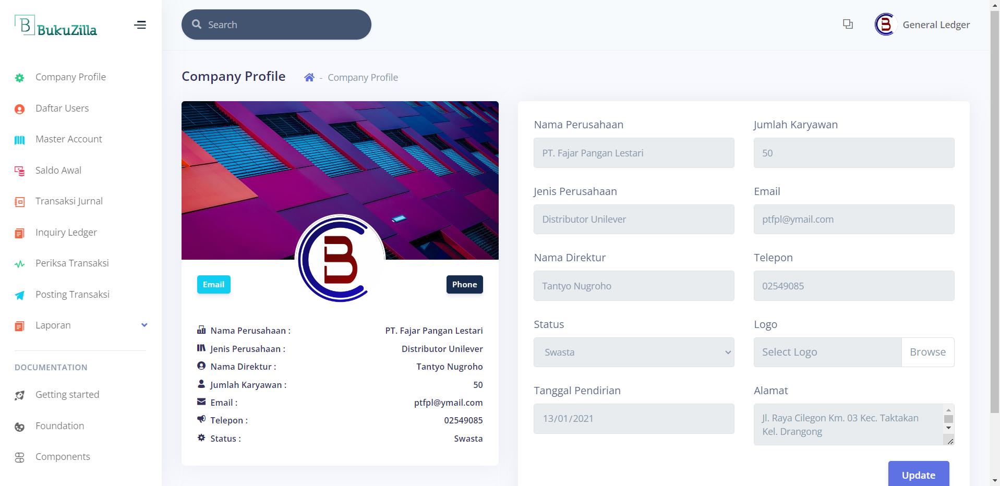
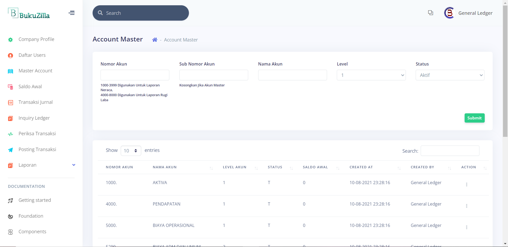
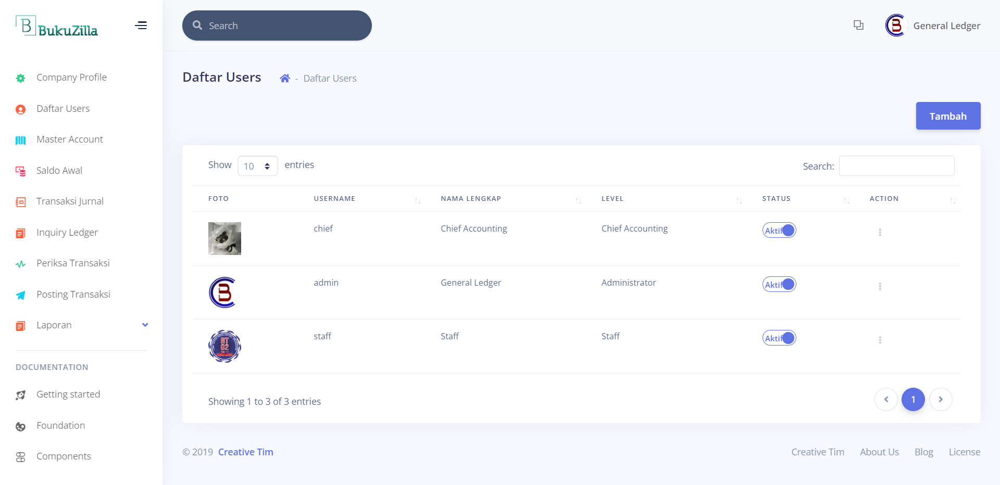
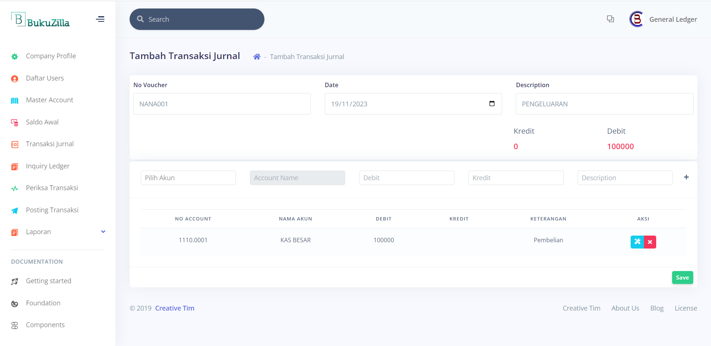
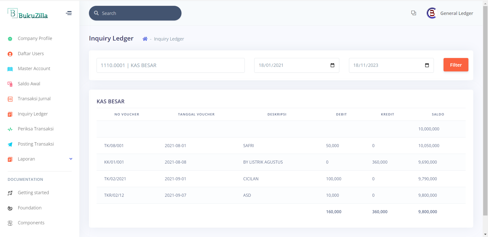
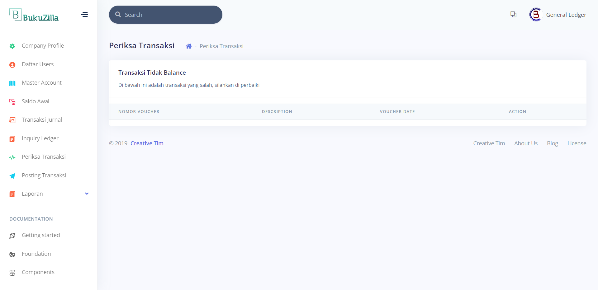
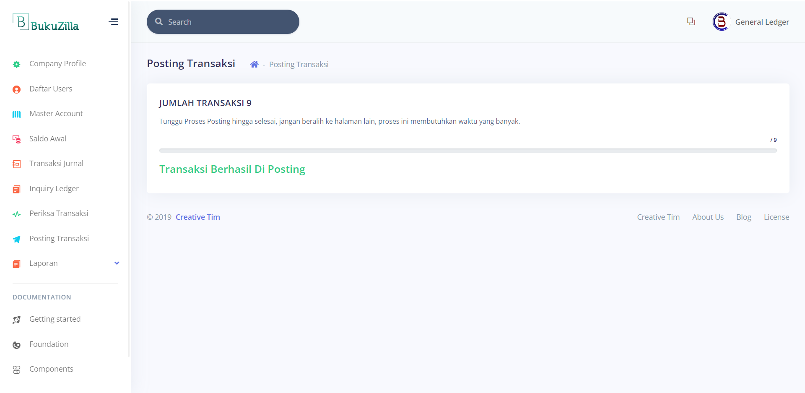
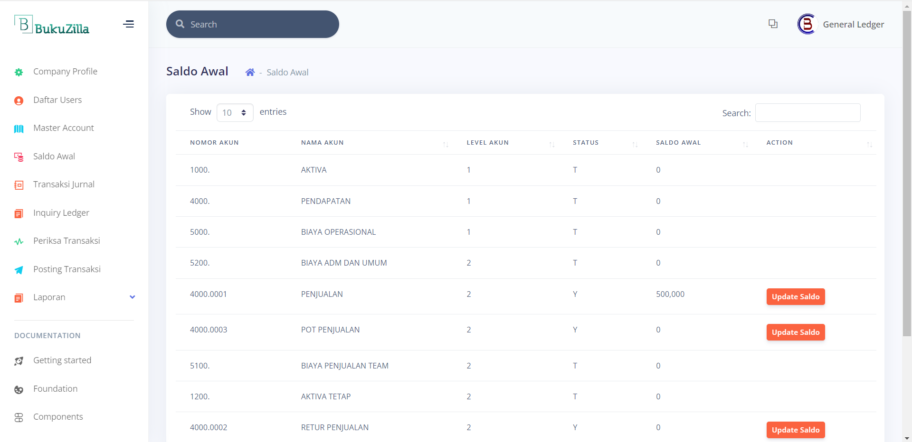

# Aplikasi Bukubesar Akuntansi

Aplikasi ini merupakan sistem akuntansi yang dibangun menggunakan CodeIgniter 3 dan MySQL. Aplikasi ini dirancang untuk mengelola transaksi dan menghasilkan laporan bukubesar. Terdapat tiga peran akses: General Ledger, Chief Accounting, dan Karyawan.

## Fitur

1. **Company Profile Perusahaan**: Menampilkan informasi profil perusahaan.
2. **Master Account**: Manajemen akun-akun dalam sistem.
3. **Daftar Users**: Pendaftaran dan manajemen pengguna aplikasi.
4. **Daftar Transaksi Jurnal**: Menampilkan daftar transaksi jurnal yang telah dilakukan.
5. **Tambah Jurnal Transaksi**: Membuat transaksi jurnal baru.
6. **Inquiry Ledger**: Melihat dan menelusuri buku besar.
7. **Periksa Kesalahan Transaksi**: Memeriksa kesalahan dalam transaksi.
8. **Posting Transaksi**: Melakukan posting transaksi ke dalam buku besar.
9. **Saldo Awal**: Menyimpan dan mengelola saldo awal akun.

## Screenshot

### 1. Company Profile Perusahaan

### 2. Master Account

### 3. Daftar Users

### 4. Daftar Transaksi Jurnal

### 5. Tambah Jurnal Transaksi

### 6. Inquiry Ledger

### 7. Periksa Kesalahan Transaksi

### 8. Posting Transaksi

### 9. Saldo Awal

## Role Akses

1. **General Ledger**
2. **Chief Accounting**
3. **Karyawan**
